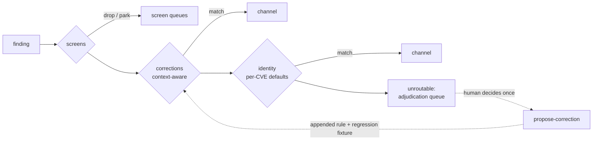

# Pattern 3: the learning routing registry

A deterministic fix-channel routing engine for vulnerability findings that
**learns from its misroutes**. Rules live as reviewable YAML in git; when
routing sends a finding to the wrong home — SharePoint turns out not to be in
the central patch bundle, Tomcat turns out to be app-layer-installed rather
than baked into the base image — the correction is appended as data with full
provenance, a regression fixture pins it forever, and the next run routes
correctly. No ML anywhere: the learning is in the accumulated data.

Born from the July 2026 full-cohort routing exercise: 9,919 CVEs published in
one month, 21% screened instantly, 57% collapsed into **ten** grouped channel
records, 22% unroutable. The unroutable set is the real analyst problem — and
each adjudication of it should become a rule, so the 22% falls month over
month. The falling number is the point:

```
unroutable_pct, run over run = is the registry actually learning?
```

## The two-axis model

Routing a finding needs two different questions answered:

| Axis | Question | Granularity | Rule file |
|---|---|---|---|
| **Identity** | What software is this? (CNA, vendor, package, purl, keywords) | per-CVE | `registry/rules/identity.yaml` |
| **Context** | How is this instance deployed *here*? (base image vs app layer, central bundle vs user-installed, managed vs not) | per-finding | `registry/rules/corrections.yaml` |

The same CVE routes differently per instance. The shipped seed demonstrates
it: an Apache Tomcat CVE routes to `middleware` (host install, identity
default), `platform-rehydrate` (context: `image_layer: base`), or
`build-dependency` (context: `image_layer: app`) — three homes, one CVE.

Identity matching is deliberately **advisory-first** (CNA, vendor, purl,
keywords), not CPE-based: in the July 2026 cohort, 67% of CVEs had no CPE
data at NVD at disclosure time.

## Pipeline



The dotted edge is the learning loop; everything else is a rule table.

First full match wins; within a stage, `(priority, id)` order. Context
predicates only fire when the context key is **present** on the finding — no
data, no override, so corrections are safe by default.

## Documentation

| Doc | Read it when |
|---|---|
| [Tutorial](tutorial.md) | First contact — route the sample cohort and learn your first correction in 15 minutes, real outputs included |
| [Schema reference](schema-reference.md) | Writing rules — every field, the exact matching semantics, the finding input format |
| [Design rationale](design.md) | Before proposing structural changes — each decision with the alternative it rejected |
| [Workplace translation](workplace-translation.md) | Lifting the module into a private org config repo — channels, enrichers, misroute detectors, governance |

## Quickstart

```bash
pip install -e ".[test,routing]"   # from the repo root

python -m routing_registry validate --registry registry
python -m routing_registry route --registry registry \
    --findings examples/findings.sample.jsonl --stats
python -m routing_registry route --registry registry \
    --findings examples/findings.sample.jsonl --unroutable-only

pytest -q    # includes the regression-fixture gate
```

Findings are JSONL or CSV with any of: `id`, `cve_id`, `cna`, `vendor`,
`product`, `package`, `purl`, `description`, `nvd_status`, `source`, and an
optional `context` object (JSONL only) carrying deployment facts.

## The learning loop

1. **Detect** a misroute. The three detectors worth wiring first:
   a finding *survives N patch cycles* it was routed into; an analyst
   *manually reassigns* a ticket; a *closure-reason mismatch* (closed as
   "remediated by cycle X" but cycle X didn't touch it).
2. **Propose** the correction — appended, never rewritten:

   ```bash
   python -m routing_registry propose-correction --registry registry \
       --route euc-user-installed \
       --match vendor=microsoft --match "keywords=visual studio" \
       --context bundle_member=false \
       --decided-by you --trigger "survived 2 central patch cycles" \
       --review-by 2027-02-01 \
       --fixture-finding /path/to/triggering-finding.json
   ```

   The append is validated against the full registry (and rolled back if it
   breaks anything), and the triggering finding becomes a regression fixture.
3. **Review** — the correction lands as a git diff someone approves.
   `git blame` on `corrections.yaml` *is* the provenance trail.
4. **Converge** — next run routes it correctly; CI re-runs every past
   fixture on every change, so rules can never silently decay.

Volatile facts carry `review_by` dates. Bundle membership is the most
volatile fact in the registry — if the central team adds the product to the
push next quarter, the rule must die at review, and the loader flags it when
the date passes.

## What a channel is (and is not)

A channel is a **delivery mechanism with a rhythm**, not an owner. Verified
vendor cadences encoded in `registry/channels.yaml` (checked 2026-08-09):

| Vendor rhythm | Rule | Source |
|---|---|---|
| Microsoft | 2nd Tuesday monthly, 10:00 PT (confirmed 2026) | [MSRC](https://www.microsoft.com/en-us/msrc/blog/2026/05/a-note-on-patch-tuesday), [release cycle](https://learn.microsoft.com/en-us/windows/deployment/update/release-cycle) |
| Oracle CPU | 3rd Tuesday of Jan/Apr/Jul/Oct; next 2026-10-20 | [oracle.com/security-alerts](https://www.oracle.com/security-alerts/) |
| Adobe | 2nd + 4th Tuesday (twice-monthly since 2026-07-14) | [CSO Online](https://www.csoonline.com/article/4192789/adobe-premieres-a-second-patch-tuesday-each-month-to-deliver-fixes-faster.html) |
| SAP | 2nd Tuesday monthly (Security Patch Day) | [support.sap.com](https://support.sap.com/en/my-support/knowledge-base/security-notes-news.html) |
| Cisco IOS/IOS XE | Bundled advisories 4th Wednesday of Mar + Sep | [Cisco policy](https://sec.cloudapps.cisco.com/security/center/resources/security_vulnerability_policy.html) |
| Ubuntu/Debian/RHEL/SUSE | Continuous errata, no fixed day | [USN](https://ubuntu.com/security/notices), [DSA](https://www.debian.org/security/), [RHSA](https://access.redhat.com/security/updates/advisory) |
| VMware (Broadcom) | Ad hoc, "as needed" | [VMSA index](https://www.broadcom.com/support/vmware-security-advisories) |
| Apple | Ad hoc; faster off-cycle drops since 2026 | [support.apple.com/100100](https://support.apple.com/en-us/100100) |
| Chrome | Weekly stable security refreshes | [release cycle](https://chromium.googlesource.com/chromium/src/+/master/docs/process/release_cycle.md) |

purl subject matching follows the [package-url spec (ECMA-427)](https://github.com/package-url/purl-spec);
the shipped `purl_prefix` rules use canonical type names from its
`purl-types-index.json` (note `pkg:golang`, not `pkg:go`).

## Prior art

The closest running system is GitLab's **VulnMapper**
([handbook](https://handbook.gitlab.com/handbook/security/product-security/vulnerability-management/automation/)) —
advisory + detection providers, automated issue creation and SLA-exception
handling, and the patch-cycle-lane discipline this registry borrows (the
cycle record assigns nobody; analysts see only what survives). VulnMapper is
closed-source and its rules are team-maintained. As of 2026-08-09 no
open-source project ships channel-cadence-aware routing or an
append-on-misroute loop; that gap is why this exists.

## Translating this to your organisation

The engine, schema, and workflow are generic; the seeded rules are the
public demonstration layer. `workplace-translation.md` walks through
lifting the module into a private config repo: replacing the seed channels
with your delivery mechanisms, filling `owner:` (a short list — channels are
~13 names, not ~10k decisions), wiring context enrichers (bundle manifest,
base-image digest table, CMDB), and pointing the misroute detectors at your
ticket system.

## Limits, stated plainly

- The registry routes findings to **channels**; channels still need owners.
  It makes owner enumeration tractable, it does not do it for you.
- Screens and identity seeds encode one month's public cohort — they are a
  starting point to correct, not a ground truth.
- Deterministic first-match means rule order is a design decision you own;
  the regression fixtures are what make re-ordering safe.
