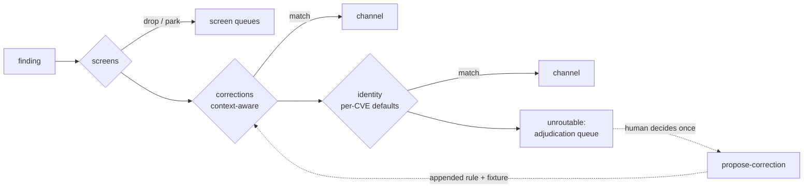

# Tutorial: from first route to first learned correction

Fifteen minutes, no infrastructure. Everything below is a real command with
its real output — run them as you read.

## 0. Setup

```bash
pip install -e ".[test,routing]"   # from the repo root
```

Sanity-check the shipped registry:

```bash
$ python -m routing_registry validate --registry registry
OK: 13 channels, 5 screens, 14 identity rules, 3 corrections
```

`validate` is also your hygiene tool: it fails on structural errors
(unknown channel, missing provenance, duplicate ids) and warns on soft
issues (a correction past its `review_by` date).

## 1. Route a cohort

The repo ships a 12-finding sample that exercises every stage:

```bash
$ python -m routing_registry route --registry registry \
    --findings examples/findings.sample.jsonl --stats
```

Each finding emits one JSON line. Three worth reading closely — the same
Tomcat CVE appearing three times with different deployment context:

```json
{"finding_id": "s-002", "cve_id": "CVE-2026-90002", "disposition": "routed",
 "channel": "platform-rehydrate", "rule_id": "corr-20260809-tomcat-base-layer", "stage": "correction"}
{"finding_id": "s-003", "cve_id": "CVE-2026-90002", "disposition": "routed",
 "channel": "build-dependency", "rule_id": "corr-20260809-tomcat-app-layer", "stage": "correction"}
{"finding_id": "s-004", "cve_id": "CVE-2026-90002", "disposition": "routed",
 "channel": "middleware", "rule_id": "id-middleware", "stage": "identity"}
```

`s-002` carries `context: {image_layer: base}` → the base-image rebuild
cycle owns it. `s-003` carries `image_layer: app` → the app team's
dependency lane owns it. `s-004` has no context → the host-install identity
default. **One CVE, three homes. That is the whole point of the two-axis
model.**

The `--stats` summary lands on stderr:

```json
{
  "total": 12,
  "screened": 3,
  "routed": 8,
  "unroutable": 1,
  "unroutable_pct": 8.3,
  "by_channel": {"build-dependency": 2, "euc-user-installed": 1, "...": "..."},
  "by_stage": {"correction": 3, "identity": 5, "screen": 3}
}
```

`unroutable_pct` is the number to chart run over run. If the registry is
learning, it falls.

## 2. Work the adjudication queue

```bash
$ python -m routing_registry route --registry registry \
    --findings examples/findings.sample.jsonl --unroutable-only
{"finding_id": "s-009", "cve_id": "CVE-2026-90007", "disposition": "unroutable", ...}
```

`s-009` is a WSO2 API Manager finding — long-tail enterprise software with
no matching rule. This queue is where analyst time actually goes, and every
entry should end its life as a rule: decide once (in the estate? which
delivery mechanism fixes it?), encode the decision, never adjudicate it
again.

## 3. Learn from a misroute

Scenario: routing sent SharePoint findings to `euc-central-bundle`
(the identity default assumes Microsoft EUC software rides the monthly
push). Two patch cycles ran. The findings are still open — because the
central bundle doesn't actually package SharePoint. That survival is a
misroute detection.

Save the triggering finding:

```bash
cat > /tmp/sharepoint-finding.json <<'EOF'
{"id": "f-sp-9", "cve_id": "CVE-2026-90020", "vendor": "Microsoft",
 "product": "SharePoint Server", "description": "RCE in SharePoint.",
 "context": {"bundle_member": false}}
EOF
```

Propose the correction:

```bash
$ python -m routing_registry propose-correction --registry registry \
    --route euc-user-installed \
    --match vendor=microsoft --match keywords=sharepoint \
    --context bundle_member=false \
    --decided-by you \
    --trigger "survived 2 central patch cycles - not in monthly bundle" \
    --review-by 2027-02-01 \
    --fixture-finding /tmp/sharepoint-finding.json
appended corr-20260809-microsoft-bundle-member — commit it as a reviewable diff
```

Three things just happened:

1. A correction rule was **appended** to `registry/rules/corrections.yaml`
   (never rewritten — existing bytes are untouched, so git history and file
   comments survive).
2. The amended registry was **validated**; had the append broken anything
   (unknown channel, bad date), it would have been rolled back.
3. The triggering finding became a **regression fixture** in
   `fixtures/regression.yaml` — from now on, CI fails if any future rule
   change re-breaks this routing.

Verify the learning took:

```bash
$ python -m routing_registry route --registry registry --findings /tmp/f.jsonl
{"finding_id": "f-sp-9", ..., "channel": "euc-user-installed",
 "rule_id": "corr-20260809-microsoft-bundle-member", "stage": "correction"}
```

And crucially — a SharePoint finding *without* the `bundle_member: false`
context still routes to `euc-central-bundle`. Context predicates only fire
when the context key is present: **no data, no override.** A correction can
never silently hijack findings whose deployment context is unknown.

## 4. Ship it as a reviewable diff

```bash
git add registry/rules/corrections.yaml fixtures/regression.yaml
git diff --cached   # the correction IS the diff — this is the review artifact
git commit -m "Learn: SharePoint not in central bundle -> euc-user-installed"
```

The pull request is the approval workflow; `git blame` on
`corrections.yaml` is the permanent provenance trail; CI re-runs every
fixture. No database, no admin UI, no drift.

## 5. Close the loop on a schedule

- **Every run**: chart `unroutable_pct`.
- **Weekly**: work the `--unroutable-only` queue; every adjudication →
  `propose-correction`.
- **Monthly**: `validate` and clear the `review_by` warnings — re-verify or
  retire stale rules. Bundle-membership facts go stale first.

The pipeline in one picture:



The dotted edge is the learning loop. Everything else is just a rule table.
